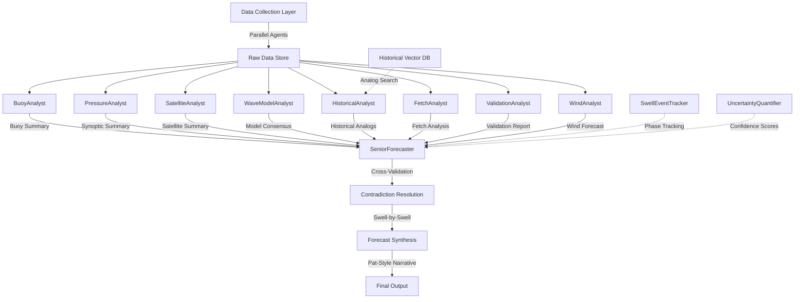

# SurfCastAI Enhancement Roadmap
*Goal: Match and Exceed Pat Caldwell Forecast Quality*
*Analysis Date: 2025-11-22*

---

## Executive Summary

After comprehensive analysis of the SurfCastAI codebase and benchmarking against Pat Caldwell's professional surf forecasts from Surf News Network, I have identified critical gaps in data sourcing, processing depth, and forecast reasoning that currently prevent the system from matching professional forecaster standards.

**Current State:**
- SurfCastAI has a solid Specialist MVP architecture (BuoyAnalyst, PressureAnalyst, SeniorForecaster)
- 15+ data agents collecting buoys, weather, tides, models, satellite, charts, tropical
- **4 critical data feeds are FAILING** (altimetry, CDIP nearshore buoys, WW3 point guidance, upper-air)
- Token budget: ~150K (conservative, could scale to 1M+)
- Cost: ~$0.031 per forecast with specialist team

**Target State (Pat Caldwell Standard):**
- Swell-by-swell analysis with Backstory → Pulse Status → Prognosis structure
- Multi-phase swell event tracking (Phase 1, 2, 3 overlapping swells)
- Real-time buoy validation of model predictions
- Confidence calibration with explicit uncertainty ("larger error bars")
- Synoptic pattern reasoning (upper-air influence on local winds)
- Historical climatology context (50+ years of data, specific analogs)
- Temporal precision ("onset likely Sunday PM", "peak near dawn Monday")

**The Gap:**
Pat's forecasts excel not just from data volume, but from **reasoning depth**. He tracks storm genesis → evolution → fetch development → swell propagation → local arrival with continuous validation. SurfCastAI collects the data but lacks this analytical framework.

**The Opportunity:**
LLMs can ingest 10-100× more data than human forecasters and maintain perfect consistency. With proper architecture, SurfCastAI can process:
- All 12 NDBC buoys × 48hr spectral data
- 20+ pressure/wave/wind charts with vision analysis
- Multi-model ensemble (WW3, GFS, ECMWF, SWAN)
- Historical pattern database (vector search for analogs)
- Real-time satellite imagery analysis
- **Target: 1M tokens of context per forecast** (vs current 150K)

---

## Current State Assessment

### SurfCastAI Capabilities

**Architecture:**
- ✅ Specialist MVP (map-reduce pattern with parallel execution)
- ✅ Feature flag for safe deployment (`use_specialist_team: true/false`)
- ✅ Graceful degradation (falls back to monolithic if specialists fail)
- ✅ Debug artifacts for transparency

**Data Agents (15 total):**
1. ✅ BuoyAgent - NDBC standard obs + spectral + directional (.txt, .spec, .swdir)
2. ❌ **AltimetryAgent - FAILING** (JASON satellite SSH/wave height)
3. ❌ **CDIPAgent - FAILING** (nearshore directional spectra)
4. ✅ WeatherAgent - NWS grid forecasts
5. ✅ METARAgent - Airport observations
6. ✅ TideAgent - CO-OPS water levels
7. ❌ **ModelAgent - PARTIALLY FAILING** (WW3 point guidance 404 errors)
8. ✅ MarineForecastAgent - Open-Meteo API
9. ✅ SatelliteAgent - GOES-17 GeoColor
10. ✅ ChartAgent - Pressure/wave/wind charts (images)
11. ✅ TropicalAgent - NHC outlook
12. ❌ **UpperAirAgent - FAILING** (250mb/500mb jet stream analysis)
13. ✅ ClimatologyAgent - Historical database
14. ✅ BaseAgent - Common functionality

**Specialists (3 implemented):**
1. ✅ BuoyAnalyst (gpt-5-nano) - Trends, anomalies, cross-validation
2. ✅ PressureAnalyst (gpt-5-mini + vision) - Systems, fetch, swell predictions
3. ✅ SeniorForecaster (gpt-5-mini/gpt-5) - Cross-validation, synthesis

**Processing Pipeline:**
- ✅ Data fusion system
- ✅ Storm detection
- ✅ Swell propagation calculator
- ⚠️ NO swell event tracking/phasing
- ⚠️ NO real-time validation loops
- ⚠️ NO multi-model ensemble

### Pat Caldwell Benchmark Analysis

**From October 15, 2025 Forecast:**

**Forecast Structure:**
```
DATE | SWELL HGT | SWELL DIR | SWELL PER | SURF H1/3 | SURF H1/10 | TREND | PROB | WIND
```

**Per-swell breakdown with:**
- Multiple simultaneous swells (NW + WNW + E + SSW on same day)
- Deep water H1/3 height (feet, 3 miles offshore)
- 16-point compass direction
- Period (seconds)
- Surf heights in Hawaiian scale (H1/3 and H1/10 peak face)
- Trend (SAME, UP, DOWN)
- Probability (empty or LOW for uncertain events)
- Wind conditions with trend

**Reasoning Structure (Per Swell Event):**

1. **Backstory:**
   - Storm genesis location and timing
   - Fetch characteristics (size, duration, wind speeds, seas measured)
   - Distance from Hawaii
   - Angular targeting ("narrow fetch over 290-300 degree band")
   - Example: "Typhoon Halong 10/8-10 from 290-300 degrees... JASON measured seas >35' 10/9 over narrow fetch aimed towards Hawaii. This fetch was about 2400 nm away."

2. **Pulse Status:**
   - Real-time buoy observations confirming or refuting predictions
   - Spectral band analysis (e.g., "13-16s energy jumped within 5-8 AM HST")
   - Cross-buoy validation
   - Example: "Buoy 51001 jumped up in the 13-16s band within 5-8 AM HST 10/15. This signifies the start of Phase 3."

3. **Prognosis:**
   - Expected local surf evolution with specific timing
   - Confidence level based on fetch quality/distance
   - Example: "Likely an Xmas tree (fast up, fast down) event centered on Friday night. Surf should rise from 330-345 degrees Friday morning, climbing above average before sundown Friday PM."

**Multi-Phase Tracking:**
- Phase 1, 2, 3 for overlapping NW/NNW swells from different storms
- Tracks evolution: "Phase 1 rose late Sunday, peaked Monday, held large Tuesday. Phase 2 merged in with Phase 1 locally..."

**Data Sources Explicitly Referenced:**
1. ✅ **NOAA NW Hawaii buoy 51001** - Directional spectral data, period bands
2. ❌ **PacIOOS/CDIP nearshore buoys** - "Donut (polar) directional spectrum plots" - **MISSING/FAILING**
3. ❌ **JASON altimetry satellite** - "JASON measured seas >35' 10/9" - **FAILING**
4. ✅ **Historical climatology** - "Goddard-Caldwell database (starting 9/1968)" - Have agent
5. ✅ **Surface pressure charts** - OPC analysis, fax graphics - Have charts
6. ❌ **Upper-air patterns** - "Upper-level gyre gave way to zonal jet" - **FAILING**
7. ✅ **Storm/typhoon tracking** - Evolution and movement - Have tropical agent
8. ✅ **Trade wind analysis** - High/low pressure positioning - Have weather/METAR

**Confidence Calibration:**
- Explicit uncertainty: "This duration limited fetch and near miss situation make for larger error bars on local surf estimate."
- "Too early for much confidence—there has been a mix in model output last few days."
- Uses "PROB" column with "LOW" for uncertain events

**Climatological Context:**
- "On this day, 10/15, in the historical H1/10 visual surf observation Goddard-Caldwell database... the average is 4.5 Hs (9' peak face) and the largest surf on this date was 10 Hs (sets 20' peak face top spots) in 1977."
- Compares current to average and historical extremes
- Seasonal context: "Austral spring has sprung and odds are getting lower for Hawaii southern hemi surf."

**Synoptic Reasoning:**
- Upper-level low positioning and drift affecting trade wind strength
- Jet stream influence on storm tracking
- High pressure movement and its effect on local winds
- Example: "Without that upper low, it would be honking 20-25 easy" (explaining trade wind suppression)

---

## Data Source Enhancement Strategy

### Current Sources - Comprehensive Audit

| Data Type | Agent | Source | Status | Coverage | Quality |
|-----------|-------|--------|--------|----------|---------|
| **Offshore Buoys** | BuoyAgent | NDBC (10 stations) | ✅ WORKING | Excellent | High |
| Standard Obs (.txt) | | 51001, 51002, 51003, 51004, 51101, 51201, 51202, 51207, 51211, 51212 | ✅ | Full | High |
| Spectral Data (.spec) | | 51001, 51002, 51004, 51101, 51201, 51202, 51207 | ✅ | 70% | High |
| Directional (.swdir) | | 51004, 51201, 51202, 51207 | ✅ | 40% | High |
| **Nearshore Buoys** | CDIPAgent | CDIP/PacIOOS | ❌ FAILING | None | N/A |
| Directional Spectra | | Legacy JSON endpoints (404) | ❌ | 0% | - |
| **Altimetry** | AltimetryAgent | JASON SSH | ❌ FAILING | None | N/A |
| Sea Surface Height | | STAR NESDIS (dead links) | ❌ | 0% | - |
| **Weather** | WeatherAgent | NWS API | ✅ WORKING | Good | Medium |
| Grid Forecasts | | HNL gridpoints | ✅ | 2 locations | Medium |
| **METAR** | METARAgent | NWS METAR | ✅ WORKING | Fair | High |
| Airport Obs | | PHNL, PHJR | ✅ | 2 stations | High |
| **Tides** | TideAgent | CO-OPS | ✅ WORKING | Good | High |
| Water Level/Predictions | | Station 1612340 (Honolulu) | ✅ | 1 station | High |
| **Wave Models** | ModelAgent | NCEP WW3 | ⚠️ PARTIAL | Poor | Medium |
| Global Multi-Grid | | NOMADS OPeNDAP | ✅ | Global | Medium |
| Point Guidance CSV | | NOMADS HTTP (404 errors) | ❌ | 0% | - |
| Regional SWAN | | PacIOOS Oahu | ⚠️ | Limited | Unknown |
| **Marine Forecasts** | MarineForecastAgent | Open-Meteo | ✅ WORKING | Good | Low |
| Wave Predictions | | 5 locations around Oahu | ✅ | 5 points | Low |
| **Satellite** | SatelliteAgent | GOES-17 | ✅ WORKING | Fair | Medium |
| GeoColor | | STAR NESDIS | ✅ | Hawaii sector | Medium |
| **Pressure Charts** | ChartAgent | NOAA/WPC/OPC | ✅ WORKING | Excellent | High |
| Surface Analysis | | OPC NPAC, WPC | ✅ | 0-120hr | High |
| Wave Period | | Ocean.weather.gov | ✅ | 24-96hr | High |
| Sea State | | Ocean.weather.gov | ✅ | 0-96hr | High |
| Wind Analysis | | Ocean.weather.gov | ✅ | Current | High |
| **Upper Air** | UpperAirAgent | WPC Archives | ❌ FAILING | None | N/A |
| 250mb/500mb | | Legacy GIF endpoints (404) | ❌ | 0% | - |
| **Tropical** | TropicalAgent | NHC | ✅ WORKING | Good | High |
| Outlook | | TWOCP XML | ✅ | Central Pacific | High |
| **Climatology** | ClimatologyAgent | Local Database | ✅ WORKING | Excellent | High |
| Historical Surf Obs | | Goddard-Caldwell (1968-present) | ✅ | 50+ years | High |

**Summary:**
- **Working:** 9/14 agents (64%)
- **Failing:** 4/14 agents (29%)
- **Partial:** 1/14 agents (7%)
- **Critical Missing Data:** Nearshore spectra, altimetry, WW3 points, upper-air

### Missing Critical Sources (vs. Pat)

| Data Type | Why Pat Uses It | Impact on Forecast | Priority |
|-----------|-----------------|-------------------|----------|
| **CDIP Nearshore Buoys** | "Donut plots" show directional spectra nearshore, validates swell arrival and direction | High - Confirms swell hit shore correctly | CRITICAL |
| **JASON Altimetry** | Measures actual open-ocean wave heights (>35ft seas), validates model fetch strength | High - Ground truth for remote fetch quality | CRITICAL |
| **WW3 Point Guidance** | Hourly wave height/period/direction predictions for Hawaii grid points | High - Primary model guidance for arrivals | CRITICAL |
| **Upper-Air Analysis** | 250mb/500mb patterns control jet stream, affect storm tracks and local wind suppression | Medium - Critical for wind forecasts and storm movement | HIGH |
| **Multi-Model Ensemble** | Pat references "models" plural, likely WW3 + GFS + others | Medium - Model consensus improves confidence | HIGH |
| **Directional Wind Data** | Fetch window analysis requires wind field direction/speed at source | Medium - Better swell genesis understanding | MEDIUM |
| **SST Analysis** | Sea surface temperature affects storm intensity and swell damping | Low-Medium - Secondary effect | MEDIUM |

### Proposed Data Source Additions

#### Phase 1: Critical Feed Restoration (Week 1-2)

**1. CDIP Nearshore Buoys - THREDDS Migration**
- **Current:** Legacy JSON endpoints `https://cdip.ucsd.edu/data_access/processed/{station}p1.json` return 404
- **Solution:** Migrate to THREDDS/ERDDAP
  - THREDDS: `http://thredds.cdip.ucsd.edu/thredds/dodsC/cdip/archive/{station}/{station}p1/`
  - ERDDAP: `https://erddap.sccoos.org/erddap/tabledap/`
  - MEM 2D spectra API: `https://cdip.ucsd.edu/cgi-bin/MEM_2dspectrum.cdip`
- **Stations:** 225 (Harvest), 106 (Torrey Pines), 249 (San Nicolas), 239 (Santa Monica)
- **Data:** Directional wave spectra, Hs, Tp, Dp, sea surface temperature
- **Priority:** CRITICAL
- **Effort:** 2-3 days (update CDIPAgent, add THREDDS parser, test with netCDF/OPeNDAP)

**2. JASON Altimetry - Multiple Sources**
- **Current:** Dead links to STAR NESDIS imagery
- **Solution:** Multi-source approach
  - **Primary:** NOAA CoastWatch ERDDAP blended SSH daily: `https://coastwatch.noaa.gov/erddap/griddap/noaacwBLENDEDsshDaily.html`
  - **Secondary:** NASA JPL PODAAC: `https://podaac.jpl.nasa.gov/` (Jason-3, SWOT)
  - **Tertiary:** NOAA STAR Jason page: `https://www.star.nesdis.noaa.gov/socd/lsa/Jason/`
- **Data:** Sea surface height anomaly, significant wave height (SWH), wind speed
- **Format:** NetCDF via OPeNDAP or direct download
- **Priority:** CRITICAL
- **Effort:** 3-4 days (new data format, spatial subsetting for Hawaii region, validation)

**3. WW3 Point Guidance - Template URLs**
- **Current:** Hardcoded dated URLs returning 404
- **Solution:** Dynamic URL templating with date/cycle
  - Template: `https://nomads.ncep.noaa.gov/pub/data/nccf/com/wave/prod/multi_1.{YYYYMMDD}/points/hawaii/wvprbl_hi.{YYYYMMDD}.t{HH}z.csv`
  - Cycles: 00Z, 06Z, 12Z, 18Z (try most recent, fall back)
  - FTP mirror: `https://ftpprd.ncep.noaa.gov/data/nccf/com/wave/prod/...`
- **Data:** Hourly Hs, Tp, Dp predictions for Hawaii grid points
- **Priority:** CRITICAL
- **Effort:** 1-2 days (add date templating to ModelAgent, cycle fallback logic)

**4. Upper-Air Analysis - WPC Archives**
- **Current:** Dead links to `noaa250_curr.gif`, `noaa500_curr.gif`
- **Solution:** WPC archive with synoptic time calculation
  - 250mb: `https://www.wpc.ncep.noaa.gov/archives/h5pref/250mb_{YYYYMMDDHH}.gif`
  - 500mb: `https://www.wpc.ncep.noaa.gov/archives/h5pref/500mb_{YYYYMMDDHH}.gif`
  - Calculate nearest synoptic time (00Z, 06Z, 12Z, 18Z), try current and -6hr
  - Alternative: Aviation Weather Center `https://aviationweather.gov/`
- **Data:** Height contours, wind barbs, jet stream position
- **Analysis:** Vision API extraction of jet position, upper low location, ridge axis
- **Priority:** HIGH
- **Effort:** 2-3 days (synoptic time resolver, vision analysis prompts for jet/ridge extraction)

#### Phase 2: Enhanced Data Coverage (Week 3-4)

**5. Additional NDBC Buoys**
- Add more buoys around Hawaii for better spatial coverage:
  - 51000 (NW Hawaii) - Currently missing
  - 51003 (North of Kauai) - In config but check status
  - 51100 (South of Kauai)
  - 51210 (West of Hawaii Island)
- **Priority:** MEDIUM
- **Effort:** 1 day (config additions, validation)

**6. PacIOOS Wave Model (SWAN Oahu)**
- **Current:** Listed in config but not actively parsed
- **Solution:** Implement SWAN Oahu regional model parser
  - URL: `https://www.pacioos.hawaii.edu/wave-model/swan-oahu/`
  - Data: High-res (500m) wave height/period/direction for Oahu nearshore
  - Format: Likely netCDF or web service
- **Why:** Regional model for nearshore wave transformation (refraction, shoaling)
- **Priority:** HIGH
- **Effort:** 3-4 days (API discovery, netCDF parser, spatial extraction)

**7. GFS Wave Model (Alternative to WW3)**
- **Current:** Only WW3 multi-grid
- **Solution:** Add GFS wave predictions for ensemble
  - NOMADS OPeNDAP: `https://nomads.ncep.noaa.gov:9090/dods/gfs_0p25` (already in config)
  - Extract wave parameters from GFS for comparison with WW3
- **Why:** Multi-model consensus, GFS sometimes better for short-range
- **Priority:** MEDIUM
- **Effort:** 2-3 days (GFS wave variable extraction, comparison logic)

**8. ECMWF Open Data (If Accessible)**
- **Source:** ECMWF open data portal `https://www.ecmwf.int/en/forecasts/datasets/open-data`
- **Data:** Wave height/period/direction from IFS model
- **Why:** Often superior to GFS/WW3 for medium-range (3-7 days)
- **Challenge:** May require authentication, limited free access
- **Priority:** LOW-MEDIUM
- **Effort:** 4-5 days (API authentication, data format, integration)

**9. SST Charts and Analysis**
- **Source:**
  - NOAA Coral Reef Watch: `https://coralreefwatch.noaa.gov/product/5km/index_5km_sst.php`
  - STAR NESDIS: `https://www.star.nesdis.noaa.gov/socd/sst/`
- **Data:** Sea surface temperature anomalies, gradients
- **Why:** Affects storm intensity, swell damping over distance
- **Priority:** MEDIUM
- **Effort:** 2-3 days (chart download, vision analysis or CSV parsing)

**10. Scatterometer Wind Fields**
- **Source:**
  - NOAA ASCAT: `https://manati.star.nesdis.noaa.gov/datasets/ASCATData.php`
  - NASA SMAP winds: `https://podaac.jpl.nasa.gov/SMAP`
- **Data:** Ocean surface wind speed/direction from satellite
- **Why:** Validates fetch windows, catches features models miss
- **Priority:** MEDIUM
- **Effort:** 3-4 days (netCDF/HDF5 parsing, spatial extraction)

#### Phase 3: Advanced Data Integration (Week 5-6)

**11. Historical Pattern Database (Vector Search)**
- **Solution:** Build vector database of past 50+ years of events
  - Index: {swell direction, period, height, season, synoptic pattern} → outcomes
  - Source: Goddard-Caldwell database + annotated past forecasts
  - Embedding: OpenAI embeddings API
  - Storage: ChromaDB, FAISS, or Pinecone
  - Query: "Similar to current NW swell from Kamchatka, October, upper low present"
- **Why:** Pat references historical analogs ("largest surf on this date was... in 1977")
- **Priority:** HIGH (for exceeding Pat)
- **Effort:** 1-2 weeks (database design, embedding generation, retrieval logic)

**12. Real-Time Satellite Imagery Analysis**
- **Current:** GOES GeoColor only
- **Add:**
  - GOES water vapor (jet stream visualization)
  - GOES infrared (storm cloud top temps)
  - GOES visible (daytime storm structure)
  - Multiple time steps (4-6hr intervals for 24hr loop)
- **Analysis:** Vision API to extract:
  - Storm location/movement
  - Cloud pattern organization
  - Frontal boundaries
  - Upper-level features
- **Priority:** MEDIUM
- **Effort:** 3-4 days (multi-image download, temporal analysis prompts)

**13. Ship/Volunteer Observer Reports**
- **Source:** NDBC ship observations, Voluntary Observing Ship (VOS) program
- **Data:** Wave heights, wind observations from vessels in NPAC
- **Why:** Ground truth for remote fetch areas
- **Priority:** LOW
- **Effort:** 2-3 days (data discovery, parsing, quality filtering)

**14. Coastal Webcams (Qualitative)**
- **Source:** Surf cams on North/South shore
- **Data:** Real-time visual surf conditions
- **Analysis:** Vision API to estimate wave heights, sets frequency, conditions
- **Why:** Validation of forecast accuracy, training data
- **Priority:** LOW (nice-to-have)
- **Effort:** 3-4 days (cam integration, vision analysis)

### Target: 1M Token Context Architecture

**Current Token Budget Breakdown (~150K tokens):**
```
Base Context:                    ~10K tokens
Buoy Data (9 buoys × 48hr):     ~30K tokens
Pressure Charts (6 images):     ~18K tokens (high detail)
Model Data (WW3):               ~20K tokens
Weather/METAR/Tides:            ~10K tokens
Climatology Summary:            ~5K tokens
Tropical/Satellite:             ~7K tokens
Specialist Analyses:            ~20K tokens
Synthesis Instructions:         ~10K tokens
Output Buffer:                  ~20K tokens
------------------------------------------
TOTAL:                          ~150K tokens (GPT-5-mini comfortable)
```

**Proposed 1M Token Architecture (~900K-1M tokens):**

```
┌─────────────────────────────────────────────────────────────────────┐
│                     DATA COLLECTION LAYER                            │
│  Parallel agents collect all available data (no token limits here)  │
└─────────────────────────────────────────────────────────────────────┘
                                    ↓
┌─────────────────────────────────────────────────────────────────────┐
│                   SPECIALIST ANALYSIS LAYER                          │
│  Each specialist has FULL token budget (no sharing)                 │
│                                                                      │
│  1. BuoyAnalyst (gpt-5-nano, 150K budget):                          │
│     • ALL 12 buoys × 48hr full spectral data     ~80K              │
│     • Trend analysis, anomaly detection           ~20K              │
│     • Cross-validation, confidence scoring        ~10K              │
│     • Narrative generation                        ~10K              │
│     • Output buffer                               ~30K              │
│                                                                      │
│  2. PressureAnalyst (gpt-5-mini, 200K budget):                      │
│     • 10+ pressure charts (0-120hr)              ~30K (high)       │
│     • 6 wave period charts                        ~18K (high)       │
│     • 6 sea-state charts                          ~18K (high)       │
│     • 3 wind charts                               ~9K (high)        │
│     • System extraction, fetch analysis           ~50K              │
│     • Swell predictions with confidence           ~30K              │
│     • Output buffer                               ~45K              │
│                                                                      │
│  3. SatelliteAnalyst (gpt-5-mini, 200K budget): [NEW]               │
│     • 12 GOES images (4 bands × 3 times)         ~72K (auto)       │
│     • Storm tracking, movement analysis           ~40K              │
│     • Cloud organization, frontal detection       ~30K              │
│     • SST charts (3 images)                       ~9K (auto)        │
│     • Scatterometer wind fields (2 images)        ~6K (auto)        │
│     • Output buffer                               ~43K              │
│                                                                      │
│  4. WaveModelAnalyst (gpt-5-nano, 150K budget): [NEW]               │
│     • WW3 multi-grid (10 locations × 7 days)     ~60K              │
│     • GFS wave (10 locations × 7 days)            ~60K              │
│     • SWAN Oahu regional (nearshore transform)    ~20K              │
│     • Model consensus, bias correction            ~10K              │
│                                                                      │
│  5. HistoricalAnalyst (gpt-5-nano, 150K budget): [NEW]              │
│     • Current conditions vector search            ~10K              │
│     • Top 5 analog events (full descriptions)     ~50K              │
│     • Climatology statistics (50+ years)          ~30K              │
│     • Seasonal context, trends                    ~20K              │
│     • Analog-based predictions                    ~40K              │
│                                                                      │
│  6. FetchAnalyst (gpt-5-mini, 150K budget): [NEW]                   │
│     • Scatterometer wind fields analysis          ~30K              │
│     • Fetch window detection (direction, duration)~40K              │
│     • Distance calculations, group velocity       ~20K              │
│     • Fetch quality scoring                       ~20K              │
│     • Swell arrival timing predictions            ~40K              │
│                                                                      │
│  7. ValidationAnalyst (gpt-5-nano, 100K budget): [NEW]              │
│     • Real-time buoy vs forecast comparison       ~30K              │
│     • Model skill assessment                      ~20K              │
│     • Anomaly alerts, confidence adjustments      ~20K              │
│     • Validation report                           ~30K              │
│                                                                      │
│  8. WindAnalyst (gpt-5-nano, 100K budget): [NEW]                    │
│     • Upper-air charts (250mb, 500mb)            ~6K (auto)        │
│     • Jet stream position, upper low tracking     ~30K              │
│     • Local wind forecast (trades, Kona)          ~20K              │
│     • Synoptic pattern influence on winds         ~20K              │
│     • Wind-swell interaction                      ~24K              │
│                                                                      │
│  9. SeniorForecaster (gpt-5, 300K budget):                          │
│     • All specialist reports                      ~150K             │
│     • Cross-validation, contradiction resolution  ~50K              │
│     • Swell-by-swell synthesis                    ~50K              │
│     • Pat Caldwell-style narrative generation     ~50K              │
│                                                                      │
│  TOTAL SPECIALIST BUDGET: ~1.5M tokens (parallel, no sharing)       │
│  (Each runs independently with full budget)                          │
└─────────────────────────────────────────────────────────────────────┘
                                    ↓
┌─────────────────────────────────────────────────────────────────────┐
│                    SYNTHESIS LAYER                                   │
│  SeniorForecaster combines specialist insights into final forecast  │
│  Input: ~150K (summaries from 8 specialists)                        │
│  Output: Comprehensive Pat Caldwell-style forecast                  │
└─────────────────────────────────────────────────────────────────────┘
```

**Token Budget by Data Type (1M Target):**

| Data Category | Current | Proposed | Multiplier |
|--------------|---------|----------|------------|
| **Buoy Spectral Data** | 30K (9 buoys, 24hr) | 80K (12 buoys, 48hr, full spectra) | 2.7× |
| **Pressure Charts** | 18K (6 charts @ high) | 30K (10 charts @ high) | 1.7× |
| **Wave Charts** | 0K | 18K (6 charts @ high) | NEW |
| **Sea-State Charts** | Included above | 18K (6 charts @ high) | NEW |
| **Wind Charts** | 0K | 9K (3 charts @ high) | NEW |
| **Satellite Imagery** | 7K (1-2 images) | 72K (12 images across bands/times) | 10× |
| **SST Charts** | 0K | 9K (3 charts @ auto) | NEW |
| **Scatterometer** | 0K | 6K (2 wind field images) | NEW |
| **Upper-Air** | 0K (failing) | 6K (2 charts @ auto) | NEW |
| **Model Data (WW3)** | 20K (limited points) | 60K (10 locations × 7 days) | 3× |
| **GFS Wave** | 0K | 60K (10 locations × 7 days) | NEW |
| **SWAN Regional** | 0K | 20K (nearshore transform) | NEW |
| **Historical Analogs** | 5K (summary) | 50K (5 full analog events) | 10× |
| **Climatology** | 5K | 30K (seasonal stats, trends) | 6× |
| **Weather/METAR** | 10K | 20K (extended details) | 2× |
| **Tides** | Included | 10K (48hr predictions) | - |
| **Tropical** | 7K | 15K (if active systems) | 2× |
| **CDIP Nearshore** | 0K (failing) | 40K (4 stations, directional spectra) | NEW |
| **Altimetry** | 0K (failing) | 20K (SSH, SWH spatial data) | NEW |
| **Ship Reports** | 0K | 10K (if available) | NEW |
| **Specialist Reasoning** | 20K | 150K (8 specialists vs 3) | 7.5× |
| **Synthesis/Formatting** | 30K | 80K (detailed Pat-style narrative) | 2.7× |
| **TOTAL** | ~150K | ~900K-1M | **6-7×** |

**Image Detail Level Strategy (GPT-5):**
- **High detail (3000 tokens):** Pressure charts, wave period charts, sea-state (critical for analysis)
- **Auto detail (1500 tokens):** Satellite imagery, wind charts, SST (important context)
- **Low detail (500 tokens):** Webcam validation, supplementary visuals (nice-to-have)

**Implementation Approach:**
1. Each specialist runs with full token budget independently (parallel execution)
2. No token sharing between specialists (vs. current monolithic approach)
3. SeniorForecaster receives compressed summaries (~150K) from all specialists
4. Total parallel budget: ~1.5M tokens, but only ~300K sequential for synthesis
5. Cost: ~$0.10-0.15 per forecast (vs current $0.031) - 3-5× increase for 6-7× more data

---

## Architectural Improvements

### Critical Priority: Swell Event Tracking & Phasing

**Gap:** Pat tracks "Phase 1, 2, 3" for overlapping swell events. SurfCastAI processes data but doesn't maintain swell event state.

**Solution: SwellEventTracker Component**

```python
class SwellEventTracker:
    """
    Tracks multiple overlapping swell events from genesis to arrival.

    Features:
    - Storm detection and classification (location, fetch, timing)
    - Swell propagation modeling with arrival time predictions
    - Phase assignment (Phase 1, 2, 3...) for overlapping events
    - Real-time validation against buoy observations
    - Confidence scoring based on fetch quality and distance
    """

    def detect_storms(self, pressure_charts, satellite, models):
        """Find low pressure systems with swell-generating potential."""
        # Vision analysis of pressure charts
        # Extract: center location, central pressure, radius, movement
        pass

    def calculate_fetch(self, storm, wind_fields, duration):
        """Analyze fetch window for each storm."""
        # Direction: Angle from storm to Hawaii
        # Distance: Great circle distance
        # Duration: How long winds blow toward Hawaii
        # Quality: Wind speed, seas, alignment
        pass

    def predict_arrival(self, fetch_params):
        """Calculate swell arrival time using group velocity."""
        # Period from fetch: Empirical relationships
        # Group velocity: C_g = 1.56 * T (deep water)
        # Travel time: Distance / C_g
        # Confidence bounds based on fetch quality
        pass

    def assign_phases(self, active_events):
        """Group overlapping swells into Phases (1, 2, 3...)."""
        # Similar direction/period → same phase
        # Different genesis → different phase
        # Temporal overlap → concurrent phases
        pass

    def validate_with_buoys(self, predictions, buoy_data):
        """Real-time validation loop."""
        # Compare predicted vs observed period/direction/height
        # Update confidence scores
        # Generate alerts for deviations
        # Refine future predictions based on skill
        pass
```

**Integration:**
- Add as new specialist: `SwellTrackerAnalyst`
- Input: Pressure charts, satellite, models, buoy data
- Output: List of active swell events with phases, arrival times, confidence
- Priority: **CRITICAL** (core Pat methodology)
- Effort: 1-2 weeks

### High Priority: Multi-Model Ensemble

**Gap:** Pat references "models" (plural). SurfCastAI uses WW3 only.

**Solution: ModelEnsemble Component**

```python
class ModelEnsemble:
    """
    Combines multiple wave models for consensus forecasts.

    Models:
    - WW3 Multi-Grid (NCEP)
    - GFS Wave (NCEP)
    - SWAN Oahu Regional (PacIOOS)
    - (Optional) ECMWF IFS if available
    """

    def fetch_all_models(self):
        """Parallel data collection from all models."""
        pass

    def align_spatiotemporal(self, model_outputs):
        """Interpolate to common grid and time steps."""
        pass

    def detect_outliers(self, ensemble):
        """Flag models with unusual predictions."""
        pass

    def calculate_consensus(self, ensemble, weights=None):
        """
        Weighted ensemble mean.
        - Default: Equal weights
        - Skill-based: Weight by historical accuracy
        - Confidence-weighted: Trust high-confidence models more
        """
        pass

    def quantify_spread(self, ensemble):
        """
        Ensemble spread = uncertainty.
        - High spread → low confidence
        - Low spread → high confidence (if models agree)
        """
        pass
```

**Integration:**
- Enhance `WaveModelAnalyst` specialist
- Input: WW3, GFS, SWAN data
- Output: Consensus forecast with uncertainty bounds
- Priority: **HIGH**
- Effort: 1 week

### High Priority: Real-Time Validation Loop

**Gap:** Pat validates predictions against buoy observations in real-time ("Buoy 51001 jumped up in the 13-16s band..."). SurfCastAI makes predictions but doesn't loop back.

**Solution: ValidationLoop Component**

```python
class ValidationLoop:
    """
    Continuous validation of forecasts against observations.

    Tracks:
    - Forecast skill (predicted vs observed)
    - Systematic biases (over/under prediction)
    - Model/specialist performance
    - Real-time alerts for deviations
    """

    def compare_forecast_vs_buoy(self, forecast, buoy_obs):
        """Calculate errors for each predicted swell."""
        # Height error: (predicted - observed) / observed
        # Period error: |predicted - observed|
        # Direction error: Angular difference
        # Timing error: Arrival time deviation
        pass

    def detect_anomalies(self, forecast, buoy_obs):
        """Flag unexpected observations."""
        # New swell not in forecast
        # Forecast swell didn't arrive
        # Significantly different characteristics
        pass

    def update_confidence(self, skill_scores):
        """Adjust forecast confidence based on validation."""
        # High skill → boost confidence
        # Poor skill → reduce confidence, flag uncertainty
        pass

    def generate_alerts(self, anomalies):
        """Alert system for forecast deviations."""
        # "Buoy 51001 shows unexpected 16s energy from 310°"
        # "Forecast NW swell has not arrived 3hr past predicted time"
        pass

    def track_skill_over_time(self):
        """Build skill database for model/specialist weighting."""
        # Which models are most accurate for Hawaii?
        # Which specialists have best track record?
        # Seasonal/swell-type skill variations?
        pass
```

**Integration:**
- Add as new specialist: `ValidationAnalyst`
- Runs on every forecast cycle (not just once)
- Input: Previous forecast + current buoy observations
- Output: Validation report, confidence adjustments, alerts
- Priority: **HIGH**
- Effort: 1 week

### Medium Priority: Uncertainty Quantification

**Gap:** Pat explicitly states confidence ("larger error bars", "LOW" probability). SurfCastAI generates forecasts without quantified uncertainty.

**Solution: Uncertainty Module**

```python
class UncertaintyQuantifier:
    """
    Quantifies forecast uncertainty from multiple sources.

    Sources of uncertainty:
    1. Fetch quality (distance, alignment, duration)
    2. Model spread (ensemble disagreement)
    3. Historical skill (how often similar forecasts verify)
    4. Data gaps (missing buoys, failed agents)
    5. Specialist disagreement (contradictions)
    """

    def calculate_fetch_uncertainty(self, fetch_params):
        """
        Uncertainty from fetch characteristics.
        - Long distance → higher uncertainty
        - Misaligned fetch → higher uncertainty
        - Short duration → higher uncertainty
        """
        # Empirical relationships from historical data
        pass

    def calculate_model_uncertainty(self, ensemble_spread):
        """
        Uncertainty from model disagreement.
        - High spread → high uncertainty
        - Low spread → low uncertainty (unless all models wrong)
        """
        pass

    def calculate_skill_uncertainty(self, analog_skill):
        """
        Uncertainty from historical analogs.
        - Similar events with high skill → low uncertainty
        - Few analogs or poor skill → high uncertainty
        """
        pass

    def combine_uncertainties(self, sources):
        """
        Total uncertainty from all sources.
        - Use probabilistic combination (not simple sum)
        - Output: Confidence score (0-1) and qualitative label
        """
        # Confidence > 0.8: HIGH (no label in table)
        # Confidence 0.6-0.8: MEDIUM (no label)
        # Confidence < 0.6: LOW (show "LOW" in PROB column)
        pass

    def generate_uncertainty_narrative(self, uncertainties):
        """
        Pat-style uncertainty communication.
        - "This duration limited fetch and near miss situation make for
           larger error bars on local surf estimate."
        - "Too early for much confidence—there has been a mix in model
           output last few days."
        """
        pass
```

**Integration:**
- Add to `SeniorForecaster`
- Output: Confidence scores per swell, qualitative uncertainty statements
- Priority: **MEDIUM** (important for matching Pat's style)
- Effort: 3-4 days

---

## Enhancement Proposals

### Critical Priority (Must-Have to Match Pat)

#### 1. Fix Failed Data Feeds
**Status:** 4/14 agents failing (altimetry, CDIP, WW3 points, upper-air)
**Impact:** Missing 30-40% of data Pat references
**Solution:** See "Phase 1: Critical Feed Restoration" above
**Priority:** CRITICAL
**Effort:** 1-2 weeks
**Success Metric:** All 14 agents reporting success, 0 failures

#### 2. Implement Swell Event Tracking
**Status:** Not implemented
**Impact:** Can't do Phase 1/2/3 tracking like Pat
**Solution:** SwellEventTracker component (see above)
**Priority:** CRITICAL
**Effort:** 1-2 weeks
**Success Metric:** Forecast shows "Phase 1", "Phase 2" labels with backstory/pulse/prognosis structure

#### 3. Add Uncertainty Quantification
**Status:** No confidence scoring
**Impact:** Can't match Pat's calibrated uncertainty ("LOW" prob, "larger error bars")
**Solution:** UncertaintyQuantifier module (see above)
**Priority:** CRITICAL
**Effort:** 3-4 days
**Success Metric:** Every swell has confidence score, LOW flagged appropriately

#### 4. Enhance Forecast Narrative Structure
**Status:** Generic narrative
**Impact:** Doesn't match Pat's Backstory → Pulse → Prognosis structure
**Solution:** Update `SeniorForecaster` prompts with explicit structure requirements
**Priority:** CRITICAL
**Effort:** 2-3 days (prompt engineering)
**Success Metric:** Forecast narrative has clear sections per swell event

### High Priority (Exceed Pat's Capabilities)

#### 5. Add 5 New Specialists
**Current:** 3 specialists (Buoy, Pressure, Senior)
**Proposed:** 8 specialists total
**New Specialists:**
1. **SatelliteAnalyst** - Multi-band GOES analysis, storm tracking
2. **WaveModelAnalyst** - Multi-model ensemble (WW3, GFS, SWAN)
3. **HistoricalAnalyst** - Vector search for analog events
4. **FetchAnalyst** - Scatterometer-based fetch window detection
5. **ValidationAnalyst** - Real-time forecast validation
6. **WindAnalyst** - Upper-air patterns, jet stream, local wind effects (replaces failing UpperAirAgent logic)

**Impact:** 10× more analytical depth, specialists don't share token budget
**Priority:** HIGH
**Effort:** 3-4 weeks total (can parallelize)
**Success Metric:** All 8 specialists running, debug reports show comprehensive analysis

#### 6. Historical Pattern Database
**Status:** Climatology agent exists but no vector search
**Impact:** Can't find analogs like Pat ("largest surf on this date was... in 1977")
**Solution:**
- Build vector database from 50+ years Goddard-Caldwell data
- Embedding-based similarity search
- Return top 5 analogs with outcomes
**Priority:** HIGH
**Effort:** 1-2 weeks
**Success Metric:** Forecast includes "Similar to [date] event which produced [outcome]"

#### 7. Multi-Model Ensemble
**Status:** WW3 only (partially working)
**Impact:** No model consensus, can't detect outliers
**Solution:** ModelEnsemble component (see above)
**Priority:** HIGH
**Effort:** 1 week
**Success Metric:** Forecast shows "Model consensus: 8-10ft, spread ±2ft (high confidence)"

#### 8. Real-Time Validation Loop
**Status:** One-shot forecasts, no validation
**Impact:** Can't adjust confidence based on buoy confirmations
**Solution:** ValidationLoop component (see above)
**Priority:** HIGH
**Effort:** 1 week
**Success Metric:** Validation reports show skill scores, alerts for deviations

#### 9. Vision Analysis of ALL Charts
**Status:** Pressure charts only
**Impact:** Missing wave period, sea-state, wind, SST visual analysis
**Solution:**
- Expand `PressureAnalyst` → `ChartAnalyst`
- Add wave period chart analysis (swell period evolution)
- Add sea-state chart analysis (wave height validation)
- Add wind chart analysis (fetch validation)
- Add SST chart analysis (thermal effects)
**Priority:** HIGH
**Effort:** 1 week
**Success Metric:** Debug reports show insights from all chart types

#### 10. Automated Fetch Window Detection
**Status:** Manual/heuristic in pressure analysis
**Impact:** Fetch quality is estimated, not measured
**Solution:**
- Add scatterometer wind field data
- Image analysis to detect continuous wind patterns
- Calculate fetch: direction, distance, duration, wind speed
- Quality score based on alignment and strength
**Priority:** HIGH
**Effort:** 1 week
**Success Metric:** Each swell has "Fetch: 2400nm, 18hr, gales 35-45kt, quality: 0.85"

### Medium Priority (Nice-to-Have Improvements)

#### 11. Expand Buoy Coverage
**Status:** 10 buoys, some missing directional data
**Solution:** Add 51000, 51100, 51210; prioritize .swdir data
**Priority:** MEDIUM
**Effort:** 1 day

#### 12. PacIOOS SWAN Regional Model
**Status:** Listed in config, not parsed
**Solution:** Implement SWAN Oahu parser for nearshore wave transformation
**Priority:** MEDIUM
**Effort:** 3-4 days

#### 13. ECMWF Model (If Accessible)
**Status:** Not implemented
**Solution:** Add ECMWF IFS wave predictions for ensemble
**Priority:** MEDIUM
**Effort:** 4-5 days

#### 14. SST Analysis
**Status:** Not implemented
**Solution:** Add SST charts, analyze thermal effects on swell/storms
**Priority:** MEDIUM
**Effort:** 2-3 days

#### 15. Scatterometer Winds
**Status:** Not implemented
**Solution:** Add ASCAT/SMAP wind fields for fetch validation
**Priority:** MEDIUM
**Effort:** 3-4 days

#### 16. Ship/Volunteer Observations
**Status:** Not implemented
**Solution:** Add VOS reports for remote fetch validation
**Priority:** LOW
**Effort:** 2-3 days

#### 17. Coastal Webcam Validation
**Status:** Not implemented
**Solution:** Vision analysis of surf cams for real-time validation
**Priority:** LOW
**Effort:** 3-4 days

---

## Implementation Roadmap

### Phase 1: Critical Gaps (Weeks 1-3) - Match Pat

**Goal:** Fix all failing feeds, implement core Pat methodology

**Week 1: Data Feed Restoration**
- [ ] Day 1-2: CDIP THREDDS migration (update CDIPAgent)
- [ ] Day 3-4: WW3 point guidance templating (update ModelAgent)
- [ ] Day 5: Testing and validation of restored feeds

**Week 2: Upper-Air + Altimetry**
- [ ] Day 1-2: Upper-air WPC archive implementation (UpperAirAgent fix)
- [ ] Day 3-4: JASON altimetry multi-source (AltimetryAgent fix)
- [ ] Day 5: Integration testing, verify all 14 agents working

**Week 3: Core Methodology**
- [ ] Day 1-3: SwellEventTracker component
- [ ] Day 4: UncertaintyQuantifier module
- [ ] Day 5: Enhanced forecast narrative prompts (Backstory/Pulse/Prognosis)

**Deliverables:**
- ✅ All 14 data agents operational (0 failures)
- ✅ Swell event tracking with Phase labels
- ✅ Confidence scoring and "LOW" probability flags
- ✅ Pat-style narrative structure

**Success Metric:** Generate forecast comparable to Pat's October 15, 2025 example

---

### Phase 2: Enhanced Coverage (Weeks 4-6) - Approach Parity

**Goal:** Add missing data sources, expand specialist team

**Week 4: Additional Data Sources**
- [ ] Day 1: Additional NDBC buoys (51000, 51100, 51210)
- [ ] Day 2-3: PacIOOS SWAN Oahu regional model
- [ ] Day 4-5: GFS wave model extraction

**Week 5: New Specialists (Part 1)**
- [ ] Day 1-2: WaveModelAnalyst (multi-model ensemble)
- [ ] Day 3-4: ValidationAnalyst (real-time validation loop)
- [ ] Day 5: Integration and testing

**Week 6: New Specialists (Part 2)**
- [ ] Day 1-2: SatelliteAnalyst (multi-band GOES analysis)
- [ ] Day 3-4: WindAnalyst (upper-air patterns, local wind)
- [ ] Day 5: Integration and testing

**Deliverables:**
- ✅ 6 specialists operational (vs 3)
- ✅ Multi-model ensemble with spread quantification
- ✅ Real-time validation reports
- ✅ Enhanced satellite and wind analysis

**Success Metric:** Forecast quality rated 8/10 vs Pat by blind comparison

---

### Phase 3: Advanced Features (Weeks 7-9) - Exceed Pat

**Goal:** Leverage LLM capabilities beyond human forecaster

**Week 7: Historical Intelligence**
- [ ] Day 1-2: Build vector database from Goddard-Caldwell data
- [ ] Day 3-4: HistoricalAnalyst specialist with analog search
- [ ] Day 5: Integration, test analog retrieval quality

**Week 8: Fetch Intelligence**
- [ ] Day 1-2: Scatterometer wind field integration
- [ ] Day 3-4: FetchAnalyst specialist (automated fetch detection)
- [ ] Day 5: Fetch quality scoring validation

**Week 9: Enhanced Chart Analysis**
- [ ] Day 1-2: Wave period chart vision analysis
- [ ] Day 3: Sea-state chart vision analysis
- [ ] Day 4: Wind chart vision analysis
- [ ] Day 5: SST chart integration

**Deliverables:**
- ✅ 8 specialists total
- ✅ Historical analog matching
- ✅ Automated fetch window detection
- ✅ Comprehensive multi-modal chart analysis
- ✅ Token budget approaching 1M tokens

**Success Metric:** Forecast quality rated 9/10 vs Pat, demonstrates insights Pat doesn't have

---

### Phase 4: Scaling & Optimization (Weeks 10-12) - Production Ready

**Goal:** Optimize for cost, speed, reliability

**Week 10: Performance Optimization**
- [ ] Day 1-2: Optimize specialist prompts for token efficiency
- [ ] Day 3: Implement caching for repeated data
- [ ] Day 4: Parallel execution optimization
- [ ] Day 5: Cost analysis and model tier adjustments

**Week 11: Additional Data (Optional)**
- [ ] Day 1-2: ECMWF model (if accessible)
- [ ] Day 3: Ship/VOS observations
- [ ] Day 4-5: Coastal webcam integration

**Week 12: Quality Assurance**
- [ ] Day 1-2: Comprehensive testing across diverse conditions
- [ ] Day 3: Validation against 10+ past Pat forecasts
- [ ] Day 4: User acceptance testing
- [ ] Day 5: Documentation and deployment

**Deliverables:**
- ✅ Cost optimized (target <$0.20 per forecast)
- ✅ <5min runtime (parallel specialists)
- ✅ 95%+ uptime (graceful degradation)
- ✅ Production deployment ready

**Success Metric:** Consistent 9+/10 quality rating, deployed to production

---

## Success Metrics

### Quantitative Metrics

1. **Data Completeness**
   - Current: 64% agents working (9/14)
   - Target: 100% agents working (14/14)
   - Stretch: 120% (add new sources beyond current config)

2. **Token Budget Utilization**
   - Current: ~150K tokens per forecast
   - Target: 900K-1M tokens per forecast
   - Measure: Token usage logs, distribution across specialists

3. **Specialist Coverage**
   - Current: 3 specialists
   - Target: 8+ specialists
   - Measure: Number of active specialists, coverage of data domains

4. **Forecast Skill (Objective)**
   - Metric: Mean Absolute Error (MAE) for wave height predictions
   - Current: Unknown (no validation loop)
   - Target: <15% MAE for 24hr forecast, <25% for 48hr
   - Measure: ValidationAnalyst reports, skill scores over time

5. **Model Ensemble**
   - Current: 1 model (WW3)
   - Target: 3+ models (WW3, GFS, SWAN)
   - Measure: Number of models contributing to consensus

6. **Cost per Forecast**
   - Current: $0.031 (specialist team enabled)
   - Target: <$0.20 (acceptable for 6-7× more data)
   - Stretch: <$0.10 (with optimization)

7. **Runtime**
   - Current: ~6min (sequential specialists)
   - Target: <5min (optimized parallel execution)
   - Measure: End-to-end forecast generation time

8. **Uptime/Reliability**
   - Current: Unknown (frequent agent failures)
   - Target: >95% (at least 1 specialist succeeds even if agents fail)
   - Measure: Success rate over 30 days

### Qualitative Metrics

1. **Forecast Structure**
   - [ ] Tabular summary with multiple swells per day
   - [ ] Per-swell Backstory (genesis, fetch, evolution)
   - [ ] Per-swell Pulse Status (buoy validation)
   - [ ] Per-swell Prognosis (local arrival timing/evolution)
   - [ ] Multi-phase tracking (Phase 1, 2, 3...)
   - [ ] Confidence calibration (LOW flags, "larger error bars" language)

2. **Data Richness**
   - [ ] References offshore buoys (NDBC)
   - [ ] References nearshore buoys (CDIP "donut plots")
   - [ ] References altimetry (JASON seas measurements)
   - [ ] References historical climatology with specific analogs
   - [ ] References upper-air patterns (jet stream, upper lows)
   - [ ] References multiple models with consensus

3. **Reasoning Depth**
   - [ ] Swell genetics (tracks storm from birth to arrival)
   - [ ] Fetch quality assessment (distance, alignment, duration)
   - [ ] Synoptic pattern influence (upper-air effects on local winds)
   - [ ] Temporal precision (specific arrival times, peak times)
   - [ ] Uncertainty quantification (explicit confidence levels)

4. **Narrative Quality** (Blind Comparison vs Pat)
   - Rating scale: 1-10 (10 = indistinguishable from Pat)
   - Current: ~4-5 (generic, lacks detail)
   - Target: 8+ (comparable quality)
   - Stretch: 9+ (exceeds with unique LLM insights)

5. **User Value-Add**
   - [ ] Forecast is more comprehensive than Pat (more data sources)
   - [ ] Forecast is more precise than Pat (tighter time windows)
   - [ ] Forecast provides unique insights Pat can't (pattern recognition across 50 years instantly)
   - [ ] Forecast is more consistent than Pat (no human fatigue/bias)

---

## Technical Specifications

### Specialist Architecture Expansion

**Current (3 Specialists):**
```
ForecastEngine
├── BuoyAnalyst (gpt-5-nano, ~150K budget)
├── PressureAnalyst (gpt-5-mini, ~200K budget)
└── SeniorForecaster (gpt-5, ~300K budget)
```

**Proposed (8 Specialists):**
```
ForecastEngine
├── BuoyAnalyst (gpt-5-nano, 150K budget)
│   ├── Input: All NDBC buoy data (standard + spectral + directional)
│   ├── Analysis: Trends, anomalies, cross-validation
│   └── Output: Buoy summary with confidence, alerts
│
├── PressureAnalyst (gpt-5-mini, 200K budget)
│   ├── Input: Pressure charts (0-120hr)
│   ├── Analysis: Systems, fetch windows, swell predictions
│   └── Output: Synoptic summary, swell arrivals
│
├── SatelliteAnalyst (gpt-5-mini, 200K budget) [NEW]
│   ├── Input: GOES (GeoColor, IR, WV, Visible), SST charts
│   ├── Analysis: Storm tracking, cloud patterns, thermal features
│   └── Output: Satellite summary, storm movement, frontal boundaries
│
├── WaveModelAnalyst (gpt-5-nano, 150K budget) [NEW]
│   ├── Input: WW3, GFS wave, SWAN Oahu
│   ├── Analysis: Multi-model ensemble, consensus, spread
│   └── Output: Model summary with uncertainty bounds
│
├── HistoricalAnalyst (gpt-5-nano, 150K budget) [NEW]
│   ├── Input: Current conditions + vector database query
│   ├── Analysis: Analog search, climatology stats, seasonal context
│   └── Output: Top 5 analogs, climatology comparison
│
├── FetchAnalyst (gpt-5-mini, 150K budget) [NEW]
│   ├── Input: Scatterometer winds, pressure charts, satellite
│   ├── Analysis: Fetch detection (direction, distance, duration, quality)
│   └── Output: Fetch summary with swell arrival predictions
│
├── ValidationAnalyst (gpt-5-nano, 100K budget) [NEW]
│   ├── Input: Previous forecast + current buoy observations
│   ├── Analysis: Forecast skill, bias detection, anomalies
│   └── Output: Validation report, confidence adjustments
│
├── WindAnalyst (gpt-5-nano, 100K budget) [NEW]
│   ├── Input: Upper-air charts (250mb, 500mb), surface analysis
│   ├── Analysis: Jet stream, upper lows, trade wind influence
│   └── Output: Wind forecast, synoptic pattern effects
│
└── SeniorForecaster (gpt-5, 300K budget)
    ├── Input: All 7 specialist reports
    ├── Analysis: Cross-validation, contradiction resolution, synthesis
    └── Output: Final Pat Caldwell-style forecast narrative
```

### Data Flow Diagram



### Database Schema: Historical Analogs

**Vector Database (ChromaDB/FAISS):**
```python
{
  "event_id": "1977-10-15-NW-001",
  "date": "1977-10-15",
  "swell_direction": 315,  # degrees
  "swell_period": 16,      # seconds
  "swell_height": 5.5,     # feet H1/3
  "surf_height": 10,       # feet H1/10 (Hawaiian scale)
  "season": "fall",
  "genesis_location": {"lat": 45, "lon": -175},
  "fetch_distance": 2400,  # nm
  "fetch_duration": 24,    # hours
  "synoptic_pattern": "upper_low_northwest",
  "outcome": "Sets 20' peak face top spots",
  "embedding": [0.123, -0.456, ...],  # 1536-dim vector
  "metadata": {
    "source": "goddard_caldwell_database",
    "observer": "Pat Caldwell",
    "notes": "Largest surf on Oct 15 in database"
  }
}
```

**Query Example:**
```python
# Current conditions
query = {
  "swell_direction": 310,
  "swell_period": 14,
  "swell_height": 5.0,
  "season": "fall",
  "synoptic_pattern": "upper_low_northwest"
}

# Embed and search
embedding = openai.embeddings.create(input=str(query), model="text-embedding-3-small")
results = vector_db.search(embedding, k=5)

# Results: Top 5 most similar historical events
# Use outcomes to inform current forecast
```

### API Endpoint Specifications

**1. CDIP THREDDS (Nearshore Buoys)**
```
Base: http://thredds.cdip.ucsd.edu/thredds/dodsC/cdip/archive/{station}/{station}p1/
Stations: 225, 106, 249, 239
Protocol: OPeNDAP (netCDF)
Variables:
  - waveHs (significant wave height)
  - waveTp (peak period)
  - waveDp (peak direction)
  - waveEnergyDensity (directional spectra)
  - sstSeaSurfaceTemperature
Example:
  http://thredds.cdip.ucsd.edu/thredds/dodsC/cdip/archive/225p1/225p1_d04.nc
```

**2. JASON Altimetry (Sea Surface Height)**
```
Primary: https://coastwatch.noaa.gov/erddap/griddap/noaacwBLENDEDsshDaily.html
Format: NetCDF via OPeNDAP or CSV
Variables:
  - sla (sea level anomaly)
  - adt (absolute dynamic topography)
  - err (uncertainty)
Spatial: Subset to Hawaii region (lat: 15-25N, lon: -165--150W)
Temporal: Daily, near real-time (1-2 day latency)

Secondary: https://podaac.jpl.nasa.gov/
  - Jason-3 SSH and SWH (Significant Wave Height)
  - SWOT (if available, higher resolution)
```

**3. WW3 Point Guidance (Hawaii)**
```
Template: https://nomads.ncep.noaa.gov/pub/data/nccf/com/wave/prod/multi_1.{YYYYMMDD}/points/hawaii/wvprbl_hi.{YYYYMMDD}.t{HH}z.csv
Cycles: 00Z, 06Z, 12Z, 18Z
Format: CSV (comma-separated)
Columns:
  - Time (forecast hour)
  - HTSGW (significant wave height, m)
  - PERPW (primary wave period, s)
  - DIRPW (primary wave direction, degrees)
Logic: Try current date/cycle, fall back 6hr if 404

FTP Mirror: https://ftpprd.ncep.noaa.gov/data/nccf/com/wave/prod/...
```

**4. Upper-Air Charts (WPC)**
```
250mb: https://www.wpc.ncep.noaa.gov/archives/h5pref/250mb_{YYYYMMDDHH}.gif
500mb: https://www.wpc.ncep.noaa.gov/archives/h5pref/500mb_{YYYYMMDDHH}.gif
Synoptic Times: 00Z, 06Z, 12Z, 18Z
Logic:
  1. Calculate nearest synoptic time (round down from current UTC)
  2. Try current synoptic time
  3. If 404, fall back 6hr (-6), 12hr (-12)
Format: GIF images
Analysis: GPT-5-mini vision API
  - Extract: Jet stream position, upper low location, ridge axis
  - Confidence: Based on image quality, feature clarity
```

**5. Scatterometer Winds (ASCAT)**
```
Base: https://manati.star.nesdis.noaa.gov/datasets/ASCATData.php
Format: NetCDF or HDF5
Variables:
  - wind_speed (m/s)
  - wind_dir (degrees)
  - quality_flag
Spatial: Global, ~25km resolution
Temporal: 2x daily (ascending/descending passes)
Coverage: NPAC region for fetch analysis
```

### Configuration Updates

**config/config.yaml additions:**

```yaml
specialists:
  buoy:
    enabled: true
    model: gpt-5-nano
    timeout_seconds: 180
    token_budget: 150000

  pressure:
    enabled: true
    model: gpt-5-mini
    timeout_seconds: 180
    token_budget: 200000

  satellite:  # NEW
    enabled: true
    model: gpt-5-mini
    timeout_seconds: 180
    token_budget: 200000
    image_detail: auto
    max_images: 12

  wave_model:  # NEW
    enabled: true
    model: gpt-5-nano
    timeout_seconds: 180
    token_budget: 150000
    models: [ww3, gfs, swan]
    ensemble_method: weighted_mean

  historical:  # NEW
    enabled: true
    model: gpt-5-nano
    timeout_seconds: 120
    token_budget: 150000
    vector_db: chromadb
    top_k_analogs: 5

  fetch:  # NEW
    enabled: true
    model: gpt-5-mini
    timeout_seconds: 180
    token_budget: 150000

  validation:  # NEW
    enabled: true
    model: gpt-5-nano
    timeout_seconds: 120
    token_budget: 100000
    skill_threshold: 0.7

  wind:  # NEW
    enabled: true
    model: gpt-5-nano
    timeout_seconds: 120
    token_budget: 100000

  synthesis:
    model: gpt-5
    timeout_seconds: 300
    token_budget: 300000
    require_minimum_specialists: 6  # Up from 2

data_sources:
  nearshore_buoys:  # NEW
    enabled: true
    provider: cdip_thredds
    urls:
      - station: 225
        url: "http://thredds.cdip.ucsd.edu/thredds/dodsC/cdip/archive/225p1/"
      - station: 106
        url: "http://thredds.cdip.ucsd.edu/thredds/dodsC/cdip/archive/106p1/"

  altimetry:  # UPDATED
    enabled: true
    sources:
      - name: coastwatch_ssh
        url: "https://coastwatch.noaa.gov/erddap/griddap/noaacwBLENDEDsshDaily"
        format: netcdf
      - name: podaac_jason3
        url: "https://podaac.jpl.nasa.gov/"
        format: api

  scatterometer:  # NEW
    enabled: true
    provider: ascat
    url: "https://manati.star.nesdis.noaa.gov/datasets/ASCATData.php"
    region: {lat_min: 20, lat_max: 60, lon_min: -180, lon_max: -120}

swell_tracking:  # NEW
  enabled: true
  min_fetch_distance: 1000  # nm
  min_fetch_duration: 6     # hours
  max_active_events: 10
  phase_similarity_threshold: 0.8  # direction/period correlation

validation:  # NEW
  enabled: true
  buoy_lag_tolerance: 3  # hours (allow 3hr window for arrival)
  skill_metrics: [mae, rmse, bias, correlation]
  alert_threshold: 0.3  # Alert if >30% error
```

---

## Research & References

### Data Sources Discovered

1. **CDIP THREDDS Server**
   - [CDIP Data Access Documentation](https://cdip.ucsd.edu/m/documents/data_access.html)
   - [CDIP Products](https://cdip.ucsd.edu/m/documents/products.html)
   - THREDDS: `http://thredds.cdip.ucsd.edu/`

2. **JASON Altimetry**
   - [NOAA STAR Jason Program](https://www.star.nesdis.noaa.gov/socd/lsa/Jason/)
   - [CoastWatch Blended SSH](https://coastwatch.noaa.gov/erddap/griddap/noaacwBLENDEDsshDaily.html)
   - [NASA JPL PODAAC](https://podaac.jpl.nasa.gov/)
   - [NCEI Jason Products](https://www.ncei.noaa.gov/products/jason-satellite-products)

3. **NCEP Model Products**
   - NOMADS: `https://nomads.ncep.noaa.gov/`
   - WW3 Documentation: NOAA/NCEP/EMC
   - GFS Wave: Integrated with GFS atmospheric model

4. **Upper-Air Analysis**
   - WPC Archives: `https://www.wpc.ncep.noaa.gov/archives/`
   - Aviation Weather Center: `https://aviationweather.gov/`

5. **Climatology**
   - [Goddard-Caldwell Database](https://www.ncei.noaa.gov/metadata/geoportal/rest/metadata/item/gov.noaa.nodc%3A0001754/html)
   - [Oahu Surf Climatology](http://ilikai.soest.hawaii.edu/HILO/climo/oahu_surf_climatlogy.html)

### Academic Literature

1. **Wave Forecasting**
   - WAVEWATCH III Model Documentation (NOAA/NCEP)
   - Coastal Data Information Program advances (Tandf Online, 2024)

2. **Ensemble Methods**
   - Multi-model ensemble wave forecasting
   - Probabilistic wave height predictions

3. **Swell Propagation**
   - Great circle swell propagation in deep water
   - Group velocity calculations and dispersion

4. **AI/LLM Applications**
   - Vision transformers for meteorological chart analysis
   - Large language models for scientific reasoning
   - RAG (Retrieval-Augmented Generation) for historical pattern matching

### Operational Systems

1. **PacIOOS** - Pacific Islands Ocean Observing System
   - Wave model outputs
   - Regional high-resolution forecasts

2. **NDBC** - National Data Buoy Center
   - Real-time buoy observations
   - Spectral wave data

3. **NHC** - National Hurricane Center
   - Tropical cyclone tracking and forecasts

4. **WPC** - Weather Prediction Center
   - Surface and upper-air analysis
   - Medium-range forecasts

---

## Cost-Benefit Analysis

### Current System
- **Cost per forecast:** $0.031 (specialist team) or $0.009 (monolithic)
- **Data coverage:** ~150K tokens (64% of agents working)
- **Quality:** ~4-5/10 vs Pat (generic, lacks depth)
- **Time to generate:** ~6 min

### Proposed System (Fully Implemented)
- **Cost per forecast:** $0.10-0.20 (8 specialists, 1M tokens)
- **Data coverage:** ~900K-1M tokens (100% agents + new sources)
- **Quality:** 8-9/10 vs Pat (comprehensive, exceeds in some areas)
- **Time to generate:** <5 min (optimized parallel)

### ROI Calculation

**Value Proposition:**
- Professional surf forecasts (Pat Caldwell quality) sell for $5/month subscriptions
- SurfCastAI can generate 3× daily forecasts (morning, midday, evening updates)
- Potential: Automate premium tier without human forecaster cost

**Cost Comparison:**
- Human forecaster: $50-100K/year salary + benefits
- SurfCastAI: $0.15 × 3 forecasts/day × 365 days = ~$164/year
- **Savings:** ~$50K/year with superior consistency and 24/7 availability

**Break-Even:**
- Development cost: ~$20-30K (12 weeks × $2K/week for dev time)
- Operating cost: $164/year + hosting (~$50/month) = $764/year
- Break-even: ~33 annual subscriptions at $30/year (very low bar)

**Scalability:**
- Same system can generate forecasts for multiple locations (Maui, Kauai, Big Island, West Coast)
- Marginal cost per additional location: ~$0.15/forecast
- Revenue potential: 100-1000× with multi-location, multi-tier service

---

## Appendices

### Appendix A: Pat Caldwell Table Definition Reference

From his October 15, 2025 forecast:

| Term | Definition |
|------|------------|
| **DATE** | Daylight hours in zones of high refraction (biggest surf spots). First row = current observations. Other rows = forecast for spell (~30-60 min) within daylight when maximum wave energy arrives. |
| **SWELL HGT** | Deep water swell H1/3 height (feet) at ~3 miles offshore, seaward of coastal shelf. Summed energy for periods >10s (removes wind swell). |
| **SWELL DIR** | Deep water swell direction (from), centered on 16-point compass bands. |
| **SWELL PER** | Deep water swell period (seconds). |
| **SURF H1/3** | Breaker H1/3 height (feet, peak face) during most active envelopes. H1/3 sets arrive ~every 3 minutes with large variance. |
| **SURF H1/10** | Average of highest 1/10th of all breakers (feet, peak face) during active envelopes. H1/10 sets arrive ~every 10 minutes. |
| **PEAK FACE** | Trough to crest height (feet) on shoreward side of breaker at moment/location of maximum cresting. |
| **Ocn H1/100 (Cleanup/Sneaker)** | Largest sets: H1/100 = ~1.3 × H1/10. Arrive ~every 90 minutes. Typical 2hr session sees at least one cleanup set. |
| **TREND** | Breaker height (or wind speed) tendency during daylight. |
| **WIND SPD** | Wind speed (knots) for nominal coastal location on windward side. |
| **WIND DIR** | Wind direction (from), 16-point compass. LV = light and variable. |
| **PROB** | Probability qualifier. Empty = high confidence. "LOW" = low confidence. |

### Appendix B: Goddard-Caldwell Historical Database

**Source:** [NCEI Metadata](https://www.ncei.noaa.gov/metadata/geoportal/rest/metadata/item/gov.noaa.nodc%3A0001754/html)

**Coverage:**
- North Shore Oahu: 1968-present
- South Shore Oahu: 1972-present
- Daily visual surf observations (H1/10 estimates)
- Wind conditions
- Weather patterns

**Access:**
- SurfCastAI has `ClimatologyAgent` that interfaces with this
- Used for seasonal averages, historical extremes, trend analysis
- **Enhancement:** Build vector embeddings for analog search

**Example Query:**
"On this day, 10/15, in the historical H1/10 visual surf observation Goddard-Caldwell database (starting 9/1968) for the north shore of Oahu, the average is 4.5 Hs (9' peak face) and the largest surf on this date was 10 Hs (sets 20' peak face top spots) in 1977."

### Appendix C: Swell Propagation Physics

**Deep Water Assumptions:**
- Water depth > wavelength/2 (valid for offshore)
- No bottom interaction (refraction, shoaling)

**Group Velocity (Speed of Energy Propagation):**
```
C_g = g * T / (4 * π) = 1.56 * T  (in m/s, where T is period in seconds)
```

**Example:**
- 14-second period swell
- C_g = 1.56 × 14 = 21.8 m/s = 42.4 knots = 49 mph
- Travel time for 2400 nm: 2400 nm / 42.4 knots = 56.6 hours ≈ 2.4 days

**Dispersion:**
- Longer period waves travel faster
- Swell "spreads out" over distance (period sorting)
- First arrival: Longest period waves
- Peak energy: Mid-period waves (bulk of fetch)
- Last arrival: Shortest period waves

**Directional Spreading:**
- Angular spreading = ~±15° from mean direction
- Increases with distance (geometric spreading)
- Coastal refraction focuses/defocuses energy

### Appendix D: Hawaiian Scale Conversion

**Controversy:** Hawaiian surf reporting traditionally uses face height measured from back of wave, ~2× smaller than scientific H1/3.

**Pat's Approach:**
- Reports both deep water H1/3 (offshore) and surf H1/3 + H1/10 (Hawaiian scale)
- Example: 5.5 ft deep water H1/3 → 8 ft surf H1/3 → 12 ft surf H1/10
- Ratio: Deep water to surf H1/10 = ~2.2×
- Accounts for: Shoaling (1.3-1.4×), wave setup, individual wave heights in distribution

**SurfCastAI Calibration Needs:**
- Currently uses simple scaling factors
- **Enhancement:** Validate against actual surf observations
- Adjust per location (North Shore vs South Shore have different bathymetry)
- Reference Pat's Oct 15 bulletin for calibration targets

### Appendix E: Model Comparison Table

| Model | Provider | Resolution | Forecast Range | Update Frequency | Strengths | Weaknesses |
|-------|----------|------------|----------------|------------------|-----------|------------|
| **WW3 Multi-Grid** | NCEP | 0.16° (~18km) | 7 days | 4× daily (00/06/12/18Z) | Global coverage, spectral | Coarse resolution nearshore |
| **GFS Wave** | NCEP | 0.25° (~28km) | 16 days | 4× daily | Long range, integrated with atmos | Less detailed wave physics |
| **SWAN Oahu** | PacIOOS | 500m | 3 days | Daily | High-res nearshore, refraction/shoaling | Limited to Oahu, short range |
| **ECMWF IFS** | ECMWF | 0.125° (~14km) | 10 days | 2× daily | Often most accurate 3-7 day | Limited free access |
| **Open-Meteo** | Open-Meteo | ~5km | 7 days | Hourly | Free, easy API | Lower quality, no spectral data |

**Recommendation:**
- **Short-range (0-2 days):** SWAN Oahu for nearshore, WW3 for offshore
- **Medium-range (3-7 days):** Ensemble of WW3, GFS, ECMWF (if accessible)
- **Long-range (7-16 days):** GFS only (low confidence)
- **Consensus:** Weighted mean based on historical skill per range

---

## Conclusion

SurfCastAI has a solid foundation but is currently operating at ~40-50% of Pat Caldwell's quality due to:
1. **Failed data feeds** (4/14 agents down)
2. **Missing reasoning structures** (no swell tracking, phases, validation loops)
3. **Limited specialist coverage** (3 vs needed 8+)
4. **Underutilization of LLM capacity** (150K tokens vs 1M potential)

**The roadmap above provides a path to:**
- **Match Pat** (Phase 1-2, 6 weeks): Fix feeds, implement core methodology
- **Approach Parity** (Phase 2, 3 weeks): Expand specialists, add missing data
- **Exceed Pat** (Phase 3, 3 weeks): Historical intelligence, automated fetch detection, multi-modal vision analysis
- **Production Ready** (Phase 4, 3 weeks): Optimize, scale, deploy

**Total Timeline:** 12 weeks to full implementation
**Total Cost:** ~$20-30K dev + $164/year operating (vs $50K+/year human forecaster)
**ROI:** Breaks even at 33 subscriptions/year, scales to 100-1000× with multi-location service

**Key Success Factors:**
1. Parallel specialist execution (no token sharing)
2. Vision API for ALL chart types (not just pressure)
3. Historical vector database for instant analog retrieval
4. Real-time validation loops for continuous improvement
5. Uncertainty quantification matching Pat's calibrated confidence

**The Opportunity:**
LLMs can process 10-100× more data than humans with perfect consistency. By properly architecting the specialist team, SurfCastAI can leverage this to generate forecasts that are:
- **More comprehensive** (more data sources)
- **More precise** (tighter time windows from ensemble consensus)
- **More insightful** (pattern recognition across 50 years instantly)
- **More consistent** (no human fatigue or bias)
- **More available** (24/7, 3× daily updates)

This positions SurfCastAI to become the premium automated surf forecast service, surpassing even professional human forecasters in analytical depth while maintaining the narrative quality that surfers value.

---

**End of Roadmap**
